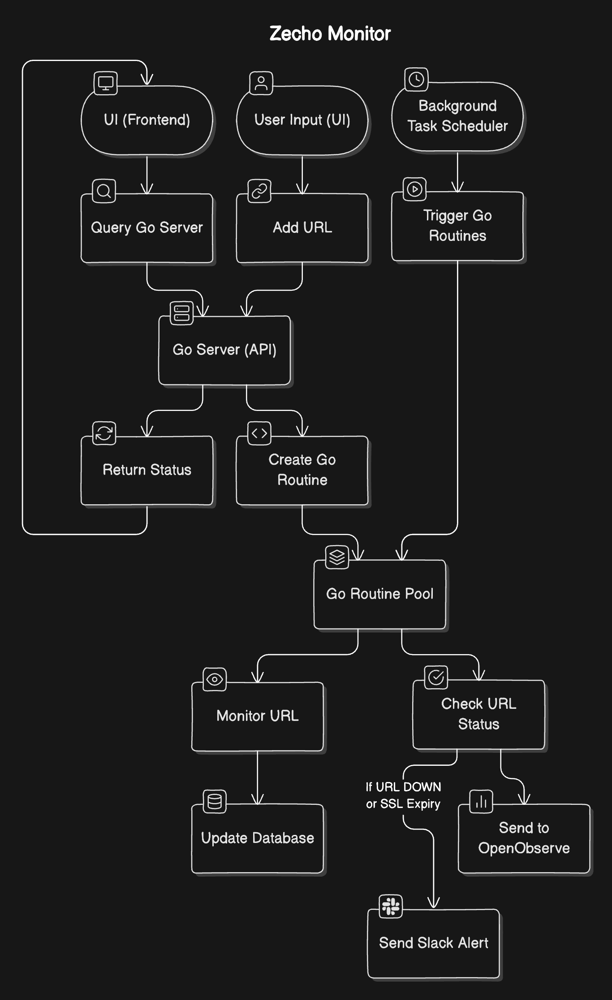

# Uptime Monitor

This project is a full-stack application that monitors the uptime of various websites and services. It checks the status and SSL certificate expiry of the given URLs and provides real-time updates on their status via a web interface. The application consists of a backend built with Go, a frontend developed with React, and a PostgreSQL database to store the monitoring data.



## Project Structure

- **manager/**: Contains the Go backend code responsible for monitoring services and interacting with the PostgreSQL database.
- **db-init/**: Contains the SQL initialization script for setting up the PostgreSQL database schema.
- **uptime-monitor-frontend/**: The React frontend that allows users to view service statuses and manage URLs being monitored.
- **docker-compose.yml**: The configuration file for Docker to orchestrate the backend, frontend, and database services.

## Features

- Monitor websites and services for uptime.
- Check SSL certificate expiry.
- Real-time status updates.
- Add, view, and delete monitored URLs.
- View historical uptime data for each monitored URL.
- Built with Docker for easy deployment.

## Technologies Used

- **Manager**: Go (Golang)
- **Frontend**: React, Chart.js for visualizing uptime history
- **Database**: PostgreSQL
- **Docker**: Containerized deployment of manager, frontend, and PostgreSQL services

## Getting Started

### Prerequisites

Make sure you have the following installed on your machine:

- [Docker](https://www.docker.com/)
- [Docker Compose](https://docs.docker.com/compose/)

### Installation

1. Clone the repository:

   ```bash
   git clone https://github.com/chaitanyasistla/uptime-monitor.git
   cd uptime-monitor
   ```

2. Ensure the `docker-compose.yml` file and necessary directories (`manager`, `db-init`, `uptime-monitor-frontend`) are in place.

3. Build and start the containers:

   ```bash
   docker compose up -d
   ```

   This will build and run the manager, frontend, and PostgreSQL containers.

### Database Initialization

The database will be automatically initialized using the `db-init/init.sql` script, which creates the necessary tables (`monitors` and `monitor_history`).

### Usage

1. Access the application by visiting: `http://localhost` in your browser.
2. To add a URL for monitoring, simply enter it into the input field and click "Add URL."
3. The manager will check the status and SSL expiry of the URL, and the frontend will update in real time with the latest information.
4. You can view the history of any monitored URL by clicking the "View History" button.

### API Endpoints

- **GET /monitors**: Retrieves all monitors.
- **POST /monitors**: Adds a new URL to be monitored.
- **DELETE /monitors/{id}**: Deletes a monitor by its ID.
- **GET /monitors/{id}/history**: Retrieves the history of a specific monitor.

### Environment Variables

The application uses the following environment variables in `docker-compose.yml`:

- `POSTGRES_USER`: PostgreSQL username (default: `chaitanyasistla`)
- `POSTGRES_PASSWORD`: PostgreSQL password (default: `password`)
- `POSTGRES_DB`: PostgreSQL database name (default: `uptime_monitor`)
- `POSTGRES_HOST`: PostgreSQL host (default: `postgres`)
- `POSTGRES_PORT`: PostgreSQL port (default: `5432`)

These are automatically configured through Docker Compose.

### Example URLs

You can monitor websites like `https://example.com` and track their SSL certificate expiration.

### Application Interface


### Stopping the Application

To stop the running containers, run:

```bash
docker-compose down
```

This will stop and remove all running containers related to the project.

### Troubleshooting

If you encounter any issues such as services not starting correctly, ensure Docker is running and that no other service is using the required ports (`8080` for manager, `5432` for PostgreSQL, `80` for frontend).

## Contributing

Feel free to fork the repository and create pull requests. Contributions, issues, and feature requests are welcome!

1. Fork the repository.
2. Create your feature branch: `git checkout -b feature/new-feature`.
3. Commit your changes: `git commit -m 'Add new feature'`.
4. Push to the branch: `git push origin feature/new-feature`.
5. Open a pull request.

## License

This project is licensed under the MIT License - see the [LICENSE](LICENSE) file for details.

## Author

- **Chaitanya Sistla** - [chaitanyasistla.com](https://chaitanyasistla.com)
